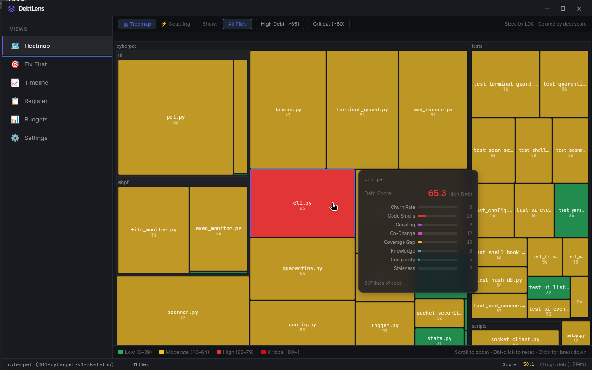
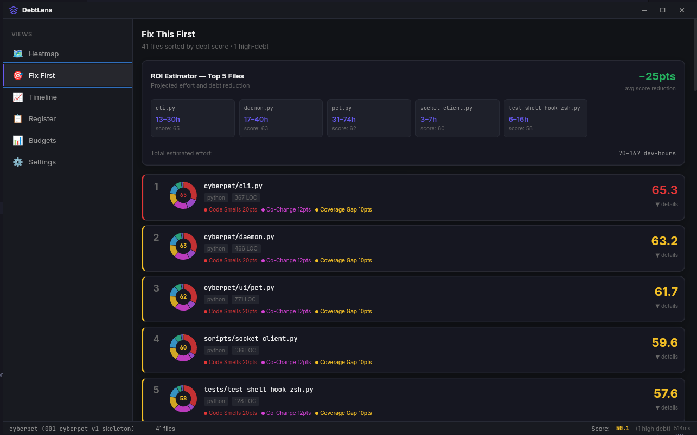

<div align="center">

# ⚡ DebtLens

**Make technical debt visible, measurable, and actionable.**

A native desktop application that scans your git repositories and gives every file a live debt score — powered by churn, complexity, coupling, code smells, and knowledge concentration.

[](https://tauri.app)
[](https://react.dev)
[](https://www.rust-lang.org)
[](LICENSE)

</div>

---

I built this because I kept wondering which parts of my codebase were quietly rotting while everything still "worked." Code reviews don't catch files that nobody understands anymore, or modules that always break together in the same commits. I wanted something that would just tell me — no SaaS subscription, no uploading my code anywhere, just point it at a folder and get answers.

---

## ✨ What it does

DebtLens connects to any local git repository and computes a **composite debt score (0–100)** for every source file using five evidence-based signals:

| Signal | What it measures |
|---|---|
| 🔥 **Churn Rate** | How frequently a file changes relative to the repo |
| 🧠 **Cognitive Complexity** | Cyclomatic complexity of functions via Tree-sitter AST |
| 🔗 **Change Coupling** | Files that always change together (hidden dependencies) |
| 👤 **Knowledge Concentration** | Bus factor — how many authors understand the file |
| 🦨 **Code Smells** | TODOs, god functions, empty catch blocks, long param lists |

Results are visualised in real-time across four views:

- **Heatmap** — color-coded grid of every file by debt score
- **Coupling Graph** — D3 force graph showing co-change clusters
- **Debt Timeline** — weekly snapshots with trend regression & forecasting
- **Priority List** — ranked remediation queue with ROI estimates

---

## 🖥️ Screenshots





---

## 🚀 Getting Started

### Prerequisites

| Tool | Version | Notes |
|---|---|---|
| [Rust](https://rustup.rs) | ≥ 1.77 | `curl --proto '=https' --tlsv1.2 -sSf https://sh.rustup.rs \| sh` |
| [Node.js](https://nodejs.org) | ≥ 20 | |
| [Git](https://git-scm.com) | ≥ 2.x | Must be installed and in `$PATH` |

**Linux only** — install system libraries for Tauri/WebKit:

```bash
# Fedora / RHEL
sudo dnf install openssl-devel gtk3-devel webkit2gtk4.1-devel \
  glib2-devel pango-devel atk-devel gdk-pixbuf2-devel cairo-devel

# Ubuntu / Debian
sudo apt install libssl-dev libgtk-3-dev libwebkit2gtk-4.1-dev \
  libglib2.0-dev libpango1.0-dev libatk1.0-dev libgdk-pixbuf-2.0-dev libcairo2-dev
```

**macOS** — no extra dependencies needed beyond Xcode Command Line Tools:

```bash
xcode-select --install
```

### Install & Run

```bash
# 1. Clone the repo
git clone https://github.com/0Ankitexe/debtlens.git
cd debtlens

# 2. Install JS dependencies
npm install

# 3. Start the app (compiles Rust + starts Vite dev server)
npm run tauri dev
```

The window opens automatically. Click **Open Repository** and point it at any local git repo.

### Build for Production

```bash
npm run tauri build
```

Produces a native installer in `src-tauri/target/release/bundle/`.

---

## 🧪 Running Tests

```bash
# Frontend unit tests (Vitest)
npx vitest run --config vitest.config.ts

# Rust unit + integration tests
cd src-tauri && cargo test
```

**Frontend test coverage:**
- `formatters.test.ts` — score formatting, severity labels, LOC helpers
- `scoring.test.ts` — composite score computation, ROI estimation
- `settingsStore.test.ts` — Zustand store defaults, clamping, weight redistribution
- `App.smoke.test.tsx` — full app render with mocked Tauri backend
- `MainContent.smoke.test.tsx` — view routing smoke test

**Rust test coverage (31 tests):**
- `analysis/churn`, `complexity`, `coupling`, `smells`, `knowledge` — algorithmic unit tests
- `tests/ipc_contracts.rs` — integration tests for every Tauri IPC command

---

## 🏗️ Architecture

```
debtlens/
├── src/                        # React frontend
│   ├── components/
│   │   ├── heatmap/            # File heatmap + coupling graph (D3)
│   │   ├── timeline/           # Debt trend snapshots + forecast
│   │   ├── priority/           # Ranked file list + ROI cards
│   │   ├── settings/           # Weight sliders + config
│   │   └── layout/             # App shell, panels, status bar
│   ├── store/                  # Zustand state (debt, workspace, settings)
│   └── lib/                    # Tauri IPC wrappers, scoring, formatters
│
└── src-tauri/                  # Rust backend (Tauri 2)
    └── src/
        ├── analysis/           # Core algorithms
        │   ├── churn.rs        # Git log-based churn rate
        │   ├── complexity.rs   # Tree-sitter cyclomatic complexity
        │   ├── coupling.rs     # Co-change + import coupling
        │   ├── smells.rs       # Regex-based smell detection
        │   └── knowledge.rs    # Git blame knowledge concentration
        └── commands/           # Tauri IPC command handlers
            ├── scoring.rs      # Full analysis + file re-analysis
            ├── db.rs           # SQLite CRUD (register, budget, watchlist)
            ├── settings.rs     # Settings persistence + migration
            └── git.rs          # Git metadata + workspace setup
```

**Data flow:** Rust analyzes the git repo → stores results in a per-workspace SQLite DB (`.debtengine/`) → streams progress events to the frontend → React renders the visualizations.

---

## ⚙️ How Scoring Works

Each file gets a **composite score 0–100** (higher = more debt):

```
score = Σ (component_score × weight)
```

Default weights (configurable in Settings):

| Component | Default Weight |
|---|---|
| Churn Rate | 22% |
| Code Smell Density | 20% |
| Coupling Index | 18% |
| Change Coupling | 12% |
| Test Coverage Gap | 12% |
| Knowledge Concentration | 8% |
| Cyclomatic Complexity | 5% |
| Decision Staleness | 3% |

Weights always sum to 100% and can be tuned per-team in Settings.

---

## 🔒 Privacy

**100% local.** No telemetry, no network calls, no cloud. All analysis is done on your machine and stored in a `.debtengine/` folder inside your repository.

---

## 📄 License

MIT © 2026 Ankit Bharti
